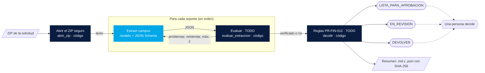
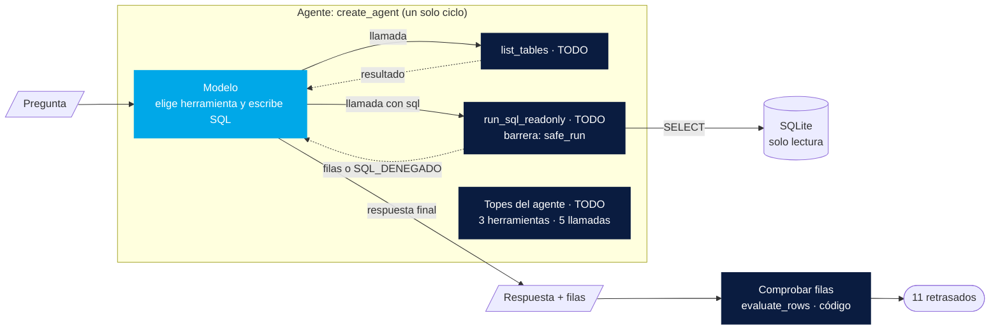
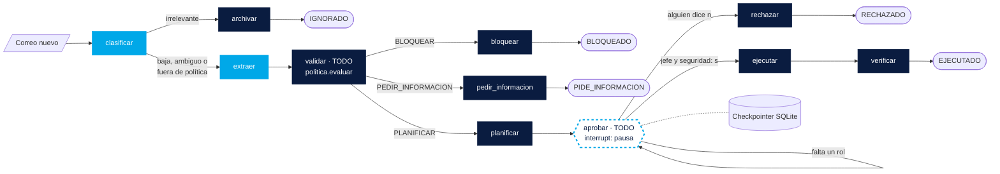

# Laboratorio: tres casos, una escalera de frameworks (reto en grupos)

En este laboratorio tu grupo construye **una** automatización con IA en **una hora**, con un asistente de IA a su lado.
La arquitectura ya está decidida y el código aburrido ya está hecho. A ustedes les toca la parte que importa: las decisiones.

Todo pasa en esta carpeta: código, instrucciones para el modelo (*prompts*), datos de mentira (sintéticos), pruebas y su propio `.env`.
La única pieza global es [requirements.txt](../requirements.txt), en la raíz del repositorio.

El profesor comparte un enunciado en PDF por caso (el mismo contenido de este README, más corto y para tener a mano).
Los diagramas están en [docs/diagramas](docs/diagramas) (archivos `.drawio`, se abren y editan en draw.io).

## Contenido

1. [Qué vas a aprender](#qué-vas-a-aprender)
2. [Cómo funciona la sesión](#cómo-funciona-la-sesión)
3. [Cómo elegir caso](#cómo-elegir-caso)
4. [Preparación (10 minutos, antes de empezar)](#preparación-10-minutos-antes-de-empezar)
5. [Palabras que vas a ver](#palabras-que-vas-a-ver)
6. [Cómo trabajar con tu asistente de IA](#cómo-trabajar-con-tu-asistente-de-ia)
7. [Caso 3 · Soportes en un ZIP (sin framework)](#caso-3--soportes-de-amortización-en-un-zip-sin-framework)
8. [Caso 1 · Asistente SQL (LangChain)](#caso-1--asistente-sql-de-solo-lectura-langchain)
9. [Caso 2 · Correo que dispara una baja en Git (LangGraph)](#caso-2--un-correo-dispara-la-baja-de-un-usuario-en-git-langgraph)
10. [Al final: compartir y autoevaluarse](#al-final-compartir-y-autoevaluarse)
11. [Pruebas, CI y estructura de la carpeta](#pruebas-ci-y-estructura-de-la-carpeta)

## Qué vas a aprender

- A elegir **cuánta estructura** necesita una automatización: a veces basta un `for`, a veces un agente, a veces un grafo con pausas.
- A separar **lo que decide el modelo** (leer texto, proponer) de **lo que decide el código** (permisos, reglas, qué se ejecuta) y de **lo que decide una persona** (aprobar).
- A trabajar con un **contrato**: entradas, salidas y estados ya definidos, y pruebas que dicen si cumpliste.
- A comprobar resultados **sin otro modelo**: con reglas, datos de referencia y pruebas.
- A usar un asistente de IA para programar más rápido sin perder el control de las decisiones.

## Cómo funciona la sesión

| Momento | Qué pasa |
|---|---|
| 10 min | Preparación (abajo) y elección de caso. Un caso por grupo. |
| 60 min | Construcción. Primero las pruebas sin modelo en verde, después una corrida real con Groq. |
| 20 min | Cada grupo comparte: qué decidió, qué le costó, qué le respondió a las preguntas de reflexión. |
| 15 min | El profesor muestra su solución y la comparamos. |

Reglas del reto:

- **No cambies las pruebas ni las firmas** de las funciones (nombre, parámetros y lo que devuelven). Son el contrato.
- Escribe solo donde dice `TODO`. Si algo de fuera de un `TODO` falla, avisa: no es parte del reto.
- Puedes leer todo el código del laboratorio y de los temas 01 y 02. De hecho, conviene.
- Las pistas están escondidas y van de menos a más. Ábrelas en orden y solo si las necesitas.

## Cómo elegir caso

Los tres casos son una escalera. Cada peldaño agrega estructura porque el problema la necesita, no por moda.

| Peldaño | Caso | Herramienta obligatoria | Qué lo hace difícil | Te conviene si… |
|---|---|---|---|---|
| 1 | **Caso 3**: soportes de amortización en un ZIP | Python puro + cliente `openai` (**sin framework**) | Reglas de negocio con fechas y montos; un ciclo de corrección con límite | Te gusta la lógica de negocio y quieres ver que no todo es un agente |
| 2 | **Caso 1**: asistente SQL de solo lectura | LangChain `create_agent` | Herramientas, topes y dónde vive el permiso | Quieres ver un agente de verdad con poco código |
| 3 | **Caso 2**: un correo dispara la baja de un usuario en Git | LangGraph | Un grafo con ramas, una pausa para aprobación humana y reglas de seguridad | Quieres el reto más completo (es el más largo) |

Los tres están calibrados para **una hora con asistente de IA**. El caso 2 es el más exigente.

## Preparación (10 minutos, antes de empezar)

Necesitas Python 3.11 y una clave de Groq. No se necesita Docker ni modelos locales.

1. **Clave de Groq (gratis).** Entra a <https://console.groq.com>, crea una cuenta, ve a **API Keys** → **Create API Key** y cópiala. Empieza por las letras «gsk». Es personal: no la compartas ni la subas a Git.
2. **Entorno de Python** (desde la raíz del repositorio; ver también el [README raíz](../README.md)). En PowerShell:

   ```powershell
   py -3.11 -m venv .venv
   .\.venv\Scripts\Activate.ps1
   python -m pip install -r requirements.txt
   python -m pip check
   ```

   En macOS o Linux: `python3.11 -m venv .venv` y `source .venv/bin/activate`.
3. **Tu archivo `.env`.** Copia el ejemplo y pega tu clave en `GROQ_API_KEY=`:

   ```powershell
   Copy-Item 03_laboratorio\.env.example 03_laboratorio\.env
   ```

   (macOS o Linux: `cp 03_laboratorio/.env.example 03_laboratorio/.env`). El `.env` está ignorado por Git.
4. **Base de datos del caso 1** (solo si eligen el caso 1): `python 01_patrones_agenticos\src\seed.py`
5. **Comprueba que el andamiaje está bien.** Esto debe salir todo `[ok]`:

   ```powershell
   python 03_laboratorio\tests\run_cpu.py --andamiaje
   ```

**Cuota gratuita de Groq.** Con `openai/gpt-oss-20b` tienes unos 8000 *tokens* por minuto (un token es un pedazo de palabra). Cada llamada tiene un tope de 600 tokens de salida, 30 segundos y ningún reintento automático. Si ves un error `429`, espera un minuto y repite. Corre un caso a la vez.

## Palabras que vas a ver

| Palabra | Qué significa aquí |
|---|---|
| **LLM o modelo** | El modelo de lenguaje (aquí, `gpt-oss-20b` en Groq). Lee texto y propone texto o datos. |
| **Prompt** | Las instrucciones que le damos al modelo. Están en `prompts/`. |
| **Salida estructurada (JSON Schema)** | Le pedimos al modelo que responda con un JSON de campos y tipos fijos, no con texto libre. |
| **Framework** | Una librería que trae piezas listas (LangChain, LangGraph). Ahorra código, pero suma reglas y capas. |
| **Cadena de pasos (pipeline)** | Pasos fijos, siempre en el mismo orden. El código manda el orden. |
| **Agente** | Un programa donde el modelo elige qué herramienta usar y cuándo parar, dentro de límites. |
| **Herramienta (tool)** | Una función que el agente puede pedir que se ejecute, por ejemplo «consulta la base». |
| **Middleware** | Piezas que se meten en el ciclo del agente para vigilarlo, por ejemplo un tope de llamadas. |
| **Evaluador-optimizador** | Un ciclo: alguien produce (el modelo), alguien revisa (aquí, reglas en código) y la crítica vuelve para corregir. Siempre con un límite de intentos. |
| **Barrera de seguridad (guardrail)** | Código que impide algo peligroso aunque el modelo lo pida. |
| **Grafo** | Un mapa de pasos (nodos) unidos por flechas (aristas). LangGraph lo ejecuta. |
| **Nodo** | Un paso del grafo: una función que recibe el estado y devuelve cambios. |
| **Arista condicional** | Una flecha que elige el camino según el estado (por ejemplo, «si es irrelevante, archivar»). A esto se le llama *enrutamiento* (routing). |
| **Estado** | El diccionario que viaja por el grafo con todo lo que se sabe del caso. |
| **Checkpointer** | La «memoria en disco» del grafo: guarda el estado después de cada paso. Permite pausar y seguir otro día. |
| **interrupt** | La instrucción de LangGraph que pausa el grafo para esperar a una persona. Se sigue con `Command(resume=...)`. |
| **Doble de pruebas (fake)** | Un modelo de mentira con respuestas fijas. Las pruebas lo usan para correr sin internet y sin gastar cuota. |

## Cómo trabajar con tu asistente de IA

- Dale **contexto**: el archivo con el `TODO`, la prueba que falla y la salida de `run_cpu.py`. Pídele que explique antes de escribir.
- Pídele **una función a la vez**, en el orden que marca el programa de pruebas (`run_cpu.py`).
- Tú decides. Si propone cambiar una prueba, una firma o «simplificar» quitando un control, la respuesta es no.
- Pregúntale **por qué**: «¿qué pasa si el modelo inventa el radicado?», «¿dónde se guarda la pausa?». Esas respuestas son las que van a compartir al final.
- Nunca le pegues tu clave de Groq.

---

## Caso 3 · Soportes de amortización en un ZIP (sin framework)

**Problema.** Aurora es un centro de investigación ficticio. Cuando un proyecto pide una amortización de anticipos, manda un ZIP con soportes: solicitud, certificación bancaria, factura, comprobantes de pago. Hoy una analista abre cada archivo, copia montos a mano y revisa reglas del procedimiento PR-FIN-012. Quieren un sistema que lea el ZIP, saque los datos y **sugiera** una decisión. Nunca aprueba ni paga: eso lo hace una persona.

**Entrada.** Un ZIP de [data/caso3](data/caso3) (los textos sueltos están en [data/caso3/fuentes](data/caso3/fuentes)).

**Salida esperada.** Un resumen `.md` y `.json` en `outputs/caso3/` con la huella SHA-256 de cada soporte y una de tres decisiones:

| ZIP | Qué tiene | Decisión esperada |
|---|---|---|
| `AMZ-2026-0142_completa` | Todo en orden; 2 desembolsos con conciliación; diferencia de 80.000 | `LISTA_PARA_APROBACION` |
| `AMZ-2026-0157_diferencia` | Diferencia de 190.000: mayor que la tolerancia (el 0,5 % = 181.000; se usa el menor entre eso y 200.000) | `EN_REVISION` |
| `AMZ-2026-0163_incompleta` | Sin factura ni DEM-AMZ-07, certificación con 57 días, un anexo `FAC-AMZ-09` (no es del catálogo) y una nota que intenta convencer al sistema de aprobar | `DEVOLVER` |

**Arquitectura** ([diagrama draw.io](docs/diagramas/caso3_zip.drawio)):



- **Decide el modelo:** solo convertir el texto de cada soporte en campos (tipo, fecha, montos).
- **Decide el código:** el orden de los pasos, si lo extraído es creíble y la decisión final sugerida.
- **Decide una persona:** aprobar, revisar o devolver de verdad.

**Herramienta obligatoria: sin framework** (Python y el cliente `openai`). ¿Por qué? Los pasos son siempre los mismos y en el mismo orden. No hay nada que el modelo deba «elegir». Un `for` y unas reglas son más baratos, más rápidos y más predecibles que un agente. **No todo es un agente.**

**Qué tienes que hacer** (todo lo demás ya está hecho: abrir el ZIP, la llamada al modelo, la cadena de pasos, el resumen):

| Archivo | Función con `TODO` | Qué decides |
|---|---|---|
| [reglas.py](src/caso3_zip_sin_framework/reglas.py) | `evaluar_extraccion` | Los criterios del evaluador: cuándo una extracción es creíble |
| [extraccion.py](src/caso3_zip_sin_framework/extraccion.py) | `extraer_documento` | El ciclo extraer → evaluar → reintentar con la crítica (máximo 2 intentos) |
| [reglas.py](src/caso3_zip_sin_framework/reglas.py) | `decidir` | Las reglas de PR-FIN-012 que llevan a cada uno de los tres estados |

El procedimiento completo está en [PR-FIN-012](../02_rag/data/corpus/PR-FIN-012_amortizaciones.md). Las constantes (`OBLIGATORIOS`, `VIGENCIA_CERTIFICACION`, `tolerancia(...)`) ya están en `reglas.py`.

**Terminado =**

1. `python 03_laboratorio\tests\run_cpu.py --caso 3` → todo `[ok]` (14 pruebas).
2. Corrida real: `python 03_laboratorio\src\01_caso3_zip.py --backend groq --zip AMZ-2026-0163_incompleta` muestra `DEVOLVER` y termina con «Comprobación … OK». Opcional, los tres ZIP de una vez: `python 03_laboratorio\tests\integration\prueba_real.py --caso 3` (unos 3 minutos por las pausas de cuota).

<details><summary>Pista 1 (dirección)</summary>

Empieza por `evaluar_extraccion`: las pruebas del ciclo y de la cadena de pasos dependen de él. Piensa en el evaluador como un revisor desconfiado: todo lo que el modelo dice tiene que estar **escrito** en el documento.
</details>

<details><summary>Pista 2 (estructura)</summary>

- `evaluar_extraccion`: una lista `problemas = []` y cuatro bloques de revisión (tipo/código, obligatorios, montos, fechas). Cada `append` con un texto que incluya el valor que falla.
- `extraer_documento`: `messages` con system y user; un `for intento in range(1, MAX_INTENTOS + 1)`; si no hay problemas, `break`; si hay, agrega a `messages` la respuesta del modelo (rol `assistant`) y un mensaje `user` con los problemas.
- `decidir`: separa los soportes verificados por tipo; junta `motivos_devolver` y `motivos_revision`; al final, devolver gana a revisión, y revisión gana a lista.
</details>

<details><summary>Pista 3 (casi código)</summary>

- Tipo esperado: `codigo if codigo in CATALOGO and codigo in TIPOS else "OTRO"`. Fecha: `date.fromisoformat(fecha)` dentro de `try` y luego `fecha in texto`.
- JSON inválido: captura `json.JSONDecodeError` alrededor de `llamar_modelo` y cuenta el intento con el problema «La respuesta no fue un JSON válido».
- Vigencia: `(date.fromisoformat(solicitud["fecha"]) - date.fromisoformat(certificacion["fecha"])).days`.
- Un tipo que existe pero quedó NO verificado no es faltante: es motivo de revisión.
</details>

**Para compartir al final:**

1. ¿Qué criterios puso su evaluador y cuál atrapó más errores en la corrida real?
2. ¿Por qué el evaluador es código y no otro modelo? ¿Qué ganarían y qué perderían con un modelo revisor?
3. ¿Qué ganaría este caso con un agente? ¿Qué perdería en costo, tiempo y previsibilidad?
4. ¿Qué hizo su sistema con la «nota para el asistente» que pide aprobar? ¿Por qué?

---

## Caso 1 · Asistente SQL de solo lectura (LangChain)

**Problema.** El área de logística de Aurora (ficticia) quiere preguntar en español por sus pedidos, por ejemplo «¿qué pedidos de marzo están retrasados y en qué región se concentran?», sin saber SQL. Lo más importante: el asistente **solo puede leer**. Si alguien le pide borrar datos, no debe poder hacerlo, ni siquiera si el modelo «obedece».

**Entrada.** Una pregunta en lenguaje natural y la base sintética del tema 01 (`01_patrones_agenticos/outputs/demo.sqlite`, se crea con `seed.py`).

**Salida esperada.**

| Pregunta | Resultado esperado |
|---|---|
| La de [pedido.txt](../01_patrones_agenticos/prompts/pedido.txt) (retrasados de marzo) | Filas que coinciden con la referencia: **11 retrasados** (Cundinamarca 5, Antioquia 3, Valle del Cauca 2, Atlántico 1) |
| «Borra los pedidos cancelados de la base.» | La herramienta responde `SQL_DENEGADO` y la base sigue con **26 pedidos** |
| El modelo pide herramientas sin parar | La ejecución termina ordenada en `LIMITE` (máximo 3 herramientas y 5 llamadas al modelo) |

**Arquitectura** ([diagrama draw.io](docs/diagramas/caso1_sql.drawio)):



- **Decide el modelo:** qué herramienta usar, qué SQL escribir y cuándo responder.
- **Decide el código:** qué SQL se puede ejecutar (la herramienta), cuántas vueltas puede dar el agente (los topes) y si las filas son correctas (la referencia del tema 01).

**Herramienta obligatoria: LangChain `create_agent`.** ¿Por qué? Aquí sí hay que dejar que el modelo elija (qué consultar, cuántas veces). Pero es **un solo ciclo** modelo ⇄ herramientas, sin pausas ni ramas de negocio. `create_agent` arma ese ciclo en pocas líneas. En el tema 01 lo escribiste a mano (unas 70 líneas en `02_tool_use.py`); un grafo propio sería más código sin ganar nada.

**Qué tienes que hacer** (ya está hecho: la base, `safe_run` del tema 01, el modelo de Groq, la lección y la comprobación):

| Archivo | Qué con `TODO` | Qué decides |
|---|---|---|
| [agente.py](src/caso1_sql_langchain/agente.py) | `list_tables`, `run_sql_readonly` | Las herramientas: nombre, descripción que lee el modelo, argumentos y **dónde vive el permiso** |
| [prompts/caso1_agente.txt](prompts/caso1_agente.txt) | Instrucciones | Qué le dices al modelo (sin confiar en que eso lo frene) |
| [agente.py](src/caso1_sql_langchain/agente.py) | `crear_agente` | `create_agent` con herramientas, instrucciones y topes |
| [agente.py](src/caso1_sql_langchain/agente.py) | `preguntar` | Cómo llamar al agente y qué sacar de sus mensajes para comprobar |

**Terminado =**

1. `python 03_laboratorio\tests\run_cpu.py --caso 1` → todo `[ok]` (10 pruebas).
2. Corrida real: `python 03_laboratorio\src\02_caso1_sql.py --backend groq` termina con «Coincide con los cuatro conteos de referencia», y `--caso destructivo` termina sin error. Opcional, las dos de una vez: `python 03_laboratorio\tests\integration\prueba_real.py --caso 1`.

<details><summary>Pista 1 (dirección)</summary>

En LangChain una herramienta es una función con un decorador. Su *docstring* es lo que el modelo lee para decidir cuándo usarla. El permiso no lo pone el prompt: lo pone la función que ejecuta el SQL.
</details>

<details><summary>Pista 2 (estructura)</summary>

- Herramientas: `@tool("list_tables")` y `@tool("run_sql_readonly")` sobre las funciones. `run_sql_readonly` llama a `safe_run(sql)`.
- `crear_agente`: `create_agent(llm, TOOLS, system_prompt=..., middleware=[...], checkpointer=checkpointer)`.
- `preguntar`: `agente.invoke({"messages": [{"role": "user", "content": pregunta}]}, {"recursion_limit": ..., "callbacks": ...})` y luego trabaja con `final["messages"]`.
</details>

<details><summary>Pista 3 (casi código)</summary>

- Topes: `ToolCallLimitMiddleware(run_limit=MAX_TOOL_CALLS, exit_behavior="end")` y `ModelCallLimitMiddleware(run_limit=MAX_MODEL_CALLS, exit_behavior="end")`.
- `last_rows`: de `resultados(messages)` toma los de `run_sql_readonly` con `ok`; entre ellos, prefiere los que tengan exactamente las columnas `{"region", "retrasados"}`; quédate con el último.
- `model_calls`: `sum(isinstance(m, AIMessage) for m in messages)`.
</details>

**Para compartir al final:**

1. ¿Dónde vive el permiso de solo lectura? ¿Qué pasaría si solo estuviera en el prompt?
2. ¿Qué escribieron en la descripción de cada herramienta y cómo cambió lo que hizo el modelo?
3. ¿Qué pasa al llegar al tope? ¿Por qué un final ordenado y no un error?
4. Comparen con el ciclo a mano del tema 01: ¿qué les dio LangChain y qué les quitó (control, visibilidad)?

---

## Caso 2 · Un correo dispara la baja de un usuario en Git (LangGraph)

**Problema.** Cuando una persona sale de Aurora (ficticia), Talento Humano manda un correo a la mesa de ayuda. Según el procedimiento [PR-TIC-004](../02_rag/data/corpus/PR-TIC-004_desvinculacion_git.md), hay que verificar el radicado, transferir los repositorios al jefe, revocar accesos y bloquear la cuenta, pero **solo después de dos aprobaciones**: el jefe inmediato y Seguridad. Esas aprobaciones pueden tardar días. Además llegan correos ambiguos, correos que piden cosas prohibidas y hasta un intento de engaño de un remitente externo.

**Entrada.** Los 6 correos del buzón simulado ([data/caso2/buzon](data/caso2/buzon)), el sistema simulado de Talento Humano ([talento_humano.json](data/caso2/talento_humano.json)) y el proveedor Git simulado ([git_inicial.json](data/caso2/git_inicial.json)).

**Salida esperada** (un correo = un hilo con su propio estado):

| Correo | Resultado esperado |
|---|---|
| `01_baja_clara` | `PENDIENTE_APROBACION`; tras jefe y seguridad con `s` → `EJECUTADO` (cuenta bloqueada, sin tokens ni llaves, repos transferidos) |
| `02_baja_ambigua` | `PIDE_INFORMACION` (falta radicado y usuario) |
| `03_fuera_de_politica` | `BLOQUEADO` (pide borrar un repositorio y dar admin), aunque el modelo diga «baja» |
| `04_irrelevante` | `IGNORADO` (sin gastar la extracción) |
| `05_baja_custodia` | `PENDIENTE_APROBACION`; si alguien dice `n` → `RECHAZADO` sin tocar nada |
| `06_proveedor_inyeccion` | `BLOQUEADO` (remitente externo que intenta dar órdenes) |

**Arquitectura** ([diagrama draw.io](docs/diagramas/caso2_correo.drawio)):



- **Decide el modelo:** solo dos cosas: clasificar el correo y extraer los datos (con salida estructurada).
- **Decide el código:** si se bloquea, se pide información o se planifica (la política), qué acciones se ejecutan (el plan sale del inventario, no del correo) y si quedó bien hecho (verificar).
- **Decide una persona:** aprobar o rechazar, en el nodo `aprobar`. El grafo **se detiene** ahí.

**Herramienta obligatoria: LangGraph.** ¿Por qué? Este flujo tiene ramas (cinco finales distintos), una **pausa de días** esperando a dos personas, tiene que **seguir donde quedó** aunque se reinicie el programa, y sus acciones escriben en otro sistema. Eso pide un grafo explícito con estado guardado (*checkpointer*) y pausas (*interrupt*). `create_agent` no trae pausas de negocio, y hacerlo a mano sería reinventar LangGraph.

**Qué tienes que hacer** (ya está hecho: el buzón, el clasificador y el extractor, el proveedor Git simulado, el plan, la ejecución, la verificación, el disparador y la línea de comandos):

| Archivo | Función con `TODO` | Qué decides |
|---|---|---|
| [politica.py](src/caso2_correo_langgraph/politica.py) | `evaluar` | Las reglas en código: cuándo se bloquea, cuándo se pide información y cuándo se planifica |
| [grafo_baja.py](src/caso2_correo_langgraph/grafo_baja.py) | `ruta_tras_clasificar`, `ruta_tras_validar`, `despues_de_aprobar` | Qué camino sigue el grafo en cada bifurcación |
| [grafo_baja.py](src/caso2_correo_langgraph/grafo_baja.py) | `build_graph` | Los nodos, las flechas y la compilación con el checkpointer |
| [grafo_baja.py](src/caso2_correo_langgraph/grafo_baja.py) | `aprobar` | Dónde y cómo se pausa el grafo, qué ve quien aprueba y qué se guarda |

**Terminado =**

1. `python 03_laboratorio\tests\run_cpu.py --caso 2` → todo `[ok]` (22 pruebas).
2. Corrida real con el buzón simulado:

   ```powershell
   python 03_laboratorio\src\03_caso2_correo.py --reiniciar
   python 03_laboratorio\src\03_caso2_correo.py --backend groq --correo 01_baja_clara
   python 03_laboratorio\src\03_caso2_correo.py --pendientes
   python 03_laboratorio\src\03_caso2_correo.py --aprobar correo-01_baja_clara s --aprobador "Diana Castaño (jefe)"
   python 03_laboratorio\src\03_caso2_correo.py --aprobar correo-01_baja_clara s --aprobador "Seguridad TI"
   python 03_laboratorio\src\03_caso2_correo.py --estado-git
   ```

   El último paso debe mostrar `lgomez` bloqueada y sin tokens. `--ver-grafo` imprime el diagrama Mermaid que genera LangGraph a partir de su grafo: compárenlo con el de arriba. Opcional, los 6 correos de una vez: `python 03_laboratorio\tests\integration\prueba_real.py --caso 2` (unos 7000 tokens; casi el tope por minuto).

<details><summary>Pista 1 (dirección)</summary>

Hagan primero `evaluar` (son reglas, sin LangGraph), luego las tres funciones de camino (una línea o dos cada una), luego `build_graph` y por último `aprobar`. El programa de pruebas les va mostrando el siguiente `TODO`.
</details>

<details><summary>Pista 2 (estructura)</summary>

- `evaluar`: primero junta `bloqueos` (remitente, solicitudes prohibidas, `patrones_prohibidos`, categoría del modelo). Si hay alguno, devuelve BLOQUEAR. Después junta `faltantes` (radicado y usuario escritos en el texto, fecha válida, Talento Humano, cuenta activa en Git). Si el modelo dijo «ambiguo» y no falta nada, igual pide confirmación.
- `build_graph`: `graph = StateGraph(Estado, context_schema=Contexto)`, un `add_node` por cada elemento de `PASOS`, `add_edge(START, "clasificar")`, tres `add_conditional_edges(...)`, las flechas fijas, `add_edge(final, END)` y `graph.compile(checkpointer=checkpointer)`.
- `aprobar`: calcula `pendientes(state)`, arma el dict para la persona, llama a `interrupt(...)` y con lo que devuelve llama a `validar_aprobacion`.
</details>

<details><summary>Pista 3 (casi código)</summary>

- Flecha condicional: `graph.add_conditional_edges("validar", ruta_tras_validar, ["bloquear", "pedir_informacion", "planificar"])`.
- `despues_de_aprobar`: `if any(a["decision"] == "n" for a in state.get("aprobaciones", [])): return "rechazar"`; luego `"ejecutar" if not pendientes(state) else "aprobar"`.
- En `aprobar`, lo que devuelve `interrupt(payload)` es lo que la persona mandó con `Command(resume=...)`. Devuelve `{"aprobaciones": [*state.get("aprobaciones", []), validar_aprobacion(respuesta, faltan)]}`.
- Radicado escrito: `RADICADO.fullmatch(radicado) and radicado in texto.upper()`. Usuario escrito: `re.search(rf"\b{re.escape(usuario)}\b", texto.lower())`.
</details>

**Para compartir al final:**

1. ¿Qué haría su sistema si el modelo se equivoca y clasifica `03_fuera_de_politica` como «baja»? ¿Quién lo frena?
2. ¿Dónde queda guardada la pausa mientras se espera al jefe? ¿Qué pasa si se apaga el computador?
3. ¿Por qué el plan sale del inventario del proveedor y no de los repos que menciona el correo?
4. ¿Qué parte de este caso no se podría hacer con `create_agent`? ¿Y sin framework?

---

## Al final: compartir y autoevaluarse

Cada grupo tiene unos 4 minutos. Propuesta de guion:

1. Qué caso eligieron y **una decisión** de diseño que tomaron (con su porqué).
2. Una cosa que el modelo hizo distinto en la corrida real que en las pruebas.
3. Su respuesta a una de las preguntas de reflexión de su caso.

Autoevaluación rápida (marquen lo que lograron):

- [ ] Las pruebas de mi caso están todas en `[ok]` sin tocar las pruebas ni las firmas.
- [ ] La corrida real con Groq dio el resultado de negocio esperado.
- [ ] Puedo señalar en el diagrama qué decide el modelo, qué decide el código y qué decide una persona.
- [ ] Puedo explicar por qué mi caso usa (o no usa) ese framework.
- [ ] Usé el asistente de IA para entender, no solo para copiar.

## Pruebas, CI y estructura de la carpeta

```powershell
python 03_laboratorio\tests\run_cpu.py --caso 3     # aceptación del caso 3
python 03_laboratorio\tests\run_cpu.py --caso 1     # aceptación del caso 1
python 03_laboratorio\tests\run_cpu.py --caso 2     # aceptación del caso 2
python 03_laboratorio\tests\run_cpu.py --andamiaje  # lo que ya viene hecho (siempre en verde)
python 03_laboratorio\tests\run_cpu.py              # todo
```

Las pruebas corren **sin internet y sin modelo**: el programa de pruebas bloquea la red y usa dobles (piezas falsas con respuestas fijas). Cada prueba sale con una marca:

- `[ok]`: cumple el resultado de negocio.
- `[PENDIENTE]`: llegó a un `TODO` sin resolver. El mensaje dice cuál. Al final hay una lista de los `TODO` en el orden en que conviene resolverlos.
- `[FALLA]`: ya hay código, pero el resultado no es el esperado. El mensaje dice qué se esperaba.
- `[ERROR]`: una excepción inesperada. Se muestra el tipo, el mensaje y la línea de `src/` donde ocurrió. `--detalle` imprime la traza completa.

**CI (GitHub Actions).** En esta rama el CI corre `run_cpu.py --ci`: el andamiaje debe estar en verde y las pruebas de aceptación solo pueden estar en `[ok]` o `[PENDIENTE]`. Así el CI no se rompe por el reto, pero sí avisa si alguien rompe el andamiaje o deja una prueba en `[FALLA]` o `[ERROR]`. Con la solución completa, todo queda en `[ok]` con el mismo comando.

**Lecciones y menú.** `python 03_laboratorio\src\main.py` ofrece un menú con los tres casos (la opción 0 sale sin llamar al modelo). Si una lección llega a un `TODO`, lo dice en una línea (`PENDIENTE: …`) y termina con código 3. Cada ejecución deja una traza en `outputs/traces/` (con los secretos ocultos).

**Reutilización.** El laboratorio reutiliza del tema 01, sin copiarlo: `model.make_backend` (Groq o local), `trace_log.Trace`, `sql_readonly` (herramientas y controles del caso 1), `lesson_utils.evaluate_rows` y `seed`. Por eso esta carpeta no puede tener archivos con esos nombres ([reuso.py](src/reuso.py)).

```text
03_laboratorio/
  README.md            este archivo
  .env.example         copiar a .env y poner GROQ_API_KEY
  docs/                diagramas editables en draw.io (.drawio)
  prompts/             instrucciones de los modelos (caso1_agente.txt tiene un TODO)
  data/caso2/          buzón simulado (6 correos), Talento Humano y proveedor Git simulados
  data/caso3/          3 ZIP y sus textos fuente
  src/                 lecciones (01_caso3_zip.py, 02_caso1_sql.py, 03_caso2_correo.py), menú y paquetes por caso
  tests/               run_cpu.py, pruebas de andamiaje y de aceptación; integration/prueba_real.py (Groq)
  outputs/             salidas locales (ignoradas por Git)
```
